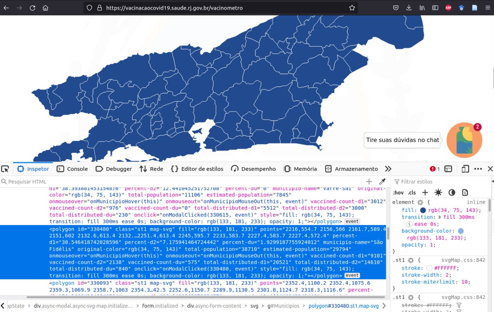

```{r setup, include=FALSE}
knitr::opts_chunk$set(echo = TRUE, warning = FALSE)
library(tidyverse)

vaccin_rio <- read.csv("vaccination_rio.csv")

```

ç

## Descrição da página 

A página que foi raspada contém dados de vacinação para os 91[^1] munícipios do Estado do Rio de Janeiro. A página é dinânmica e devido a este fator, não foi possível utilizar o pacote HTTR[^2]. Para este web scraping, o pacote utilizado foi o *webdriver*. 
O interesse pela raspagam desta página surgiu atrelado ao desenvolvimento de um trabalho acadêmico que objetivou, em conjunto com outros fatores de análise, a comparação do desempenho das 91 gestões municipais. 


## Fluxo do web scraping 

### Como fiz para imitar a requisição que aparece no site? 

Para suprir esta etapa eu utilizei o comando ctrl + shift + i e inspecionei como estava estruturado o cógido do site até encontrar os *nodes* que eu precisava acessar para extrais as informações de interesse. Criei o caminho em XPath mais adequado e apliquei este parâmetro na função (agora já no Rstúdio).

### Como fiz para iterar? 

Esta etapa não foi necessária para eu atingir meu objetivo.

### Como é a estrutura do arquivo a ser parseado? 


```{r, echo=FALSE, fig.cap="Fig1: ScreenShot do código fonta da página"}

```


## Descrição de cada coluna da base

O banco de dados está separado em 13 colunas e 91 observações.

Sobre as colunas:

- **id** = identificação do município;
- **percent_d1** = percentual de primerias doses aplicadas;
- **percent_d2** = percentual de segundas doses aplicadas;
- **percent_du** = percentual de doses únicas aplicadas;
- **municipio_name** = nome do município;
- **total_population** = total da população municipal;
- **estimated_population** = população estimada;
- **vaccined_count_d1** = número de doses 1 aplicadas;
- **vaccined_count_d2** = número de doses 2 aplicadas;
- **vaccined_count_du** = número de doses únicas aplicadas;
- **total_distributed_d1** = total de doses 1 distribuídas;
- **total_distributed_d2** = total de doses 2 distribuídas;
- **total_distributed_du** = total de doses únicas distribuídas.

```{r, echo=FALSE, fig.cap="Tabela 1: Banco de vacinacão Rio de Janeiro"}

DT::datatable(vaccin_rio, rownames = FALSE)
```


## Análise descritiva dos dados

```{r}

```


## Cometários gerais 

O desenvolvimento desse trabalho foi o meu primeiro contato com web scraping e tornou-se desafiador. Senti dificuldade no momento de transformação do HTML em um data.frame visto que a função html_table() do pacote rvest não foi possível de ser aplicada. Além desse fator, possuo diversas limitações sobre a área do conhecimento, e por isso, não consegui desenvolver solução tão elegante quanto as propostas pelos professores em sala de aula e acabei por uma solução não muito automática. Quanto a este momento, gostaria, se possível, de uma ajuda para encontrar uma nova proposta de solução da etapa de transformação dos dados baixados em uma tabela csv.


[^1]: Sabe-se que o Estado possui 92 municípios, porém, essa quantidade varia de acordo com a disponibilidade de dados no site. Até o dia da raspagem, não havia informacão para o munícipio de Quissamã.
[^2]: Houve um teste com a função GET do pacote HTTR que não retornou as informações requisitadas. 